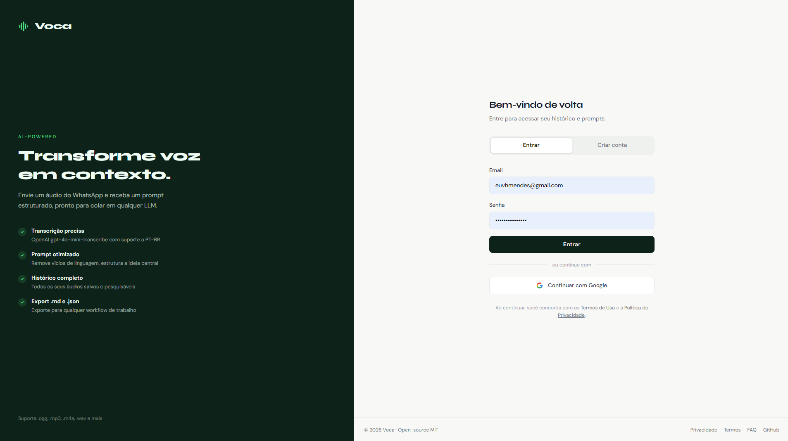
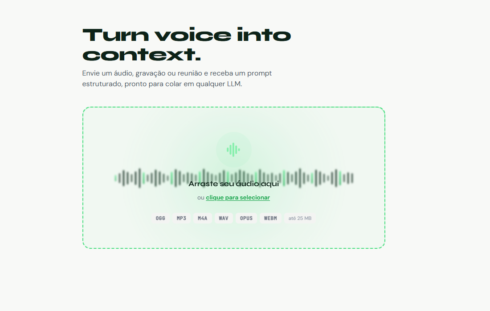
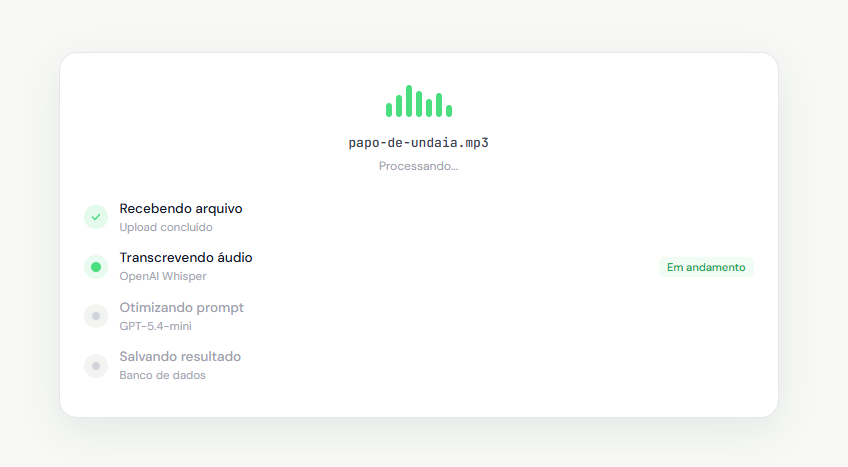
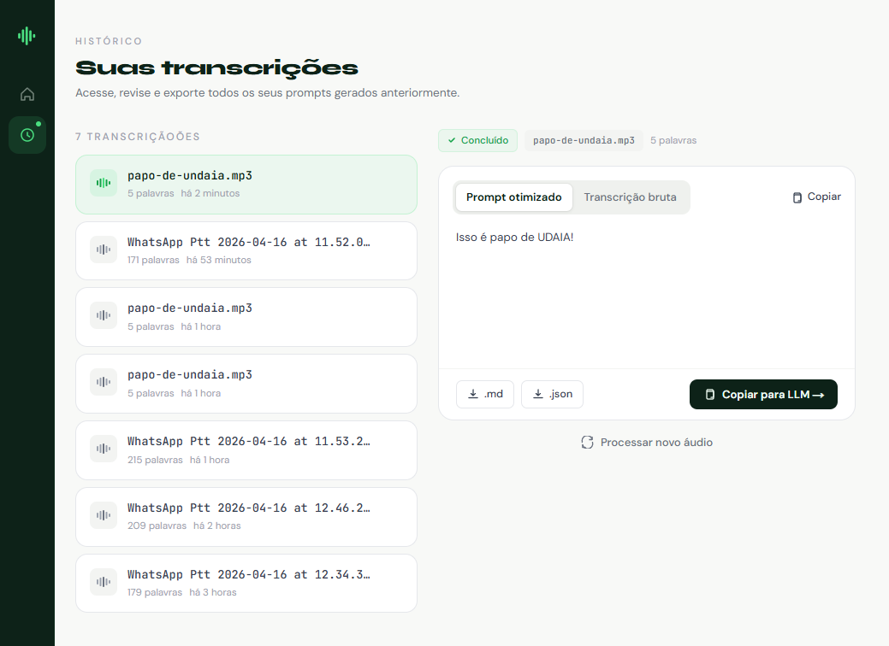

# Voca — Turn voice into context

> Transforme mensagens de voz em prompts estruturados, prontos para colar em qualquer LLM.

[](https://github.com/euvhmac/prj-voca-ai/actions/workflows/ci.yml)
[](https://github.com/euvhmac/prj-voca-ai/actions/workflows/codeql.yml)
[](https://www.typescriptlang.org/)
[](https://nextjs.org/)
[](https://tailwindcss.com/)
[](https://prisma.io/)
[](LICENSE)
[](https://vercel.com/new/clone?repository-url=https://github.com/euvhmac/prj-voca-ai)

---

<p align="center">
  
</p>

## O que é

<p align="center">
  
</p>

Você manda uma mensagem de voz no WhatsApp pensando em voz alta — sem estrutura, com vícios de linguagem, sem contexto claro. O Voca pega esse áudio e devolve um prompt cirúrgico, pronto para colar no ChatGPT, Claude ou Gemini.

**Entrada:** arquivo de áudio (`.ogg`, `.mp3`, `.m4a`, `.wav`, `.opus`, `.webm` · até 25 MB)  
**Saída:** transcrição bruta + prompt otimizado em Markdown · exportável como `.md` ou `.json`

Tudo salvo no seu histórico pessoal.

---

## Como funciona

| Upload | Processamento | Resultado |
|:---:|:---:|:---:|
|  |  |  |

1. **Transcrição** via `gpt-4o-mini-transcribe` — suporta português e 99+ idiomas
2. **Otimização** via `gpt-5.4-mini` — remove vícios, identifica a tarefa central, estrutura como prompt rico
3. **Persistência** em Neon serverless Postgres via Prisma — histórico sempre disponível

---

## Stack técnica

| Camada | Tecnologia | Por quê |
|---|---|---|
| Framework | Next.js 16 (App Router) | SSR, API routes, middleware no edge — tudo em um deploy |
| Linguagem | TypeScript strict | Sem `any` — erros em build, não em runtime |
| Estilo | Tailwind CSS v4 + CSS custom props | Design system com tokens versionados, sem UI lib externa |
| Auth | Auth.js v5 | OAuth (Google) + Credentials em ~50 linhas de config |
| ORM | Prisma v6 + Neon serverless | Queries type-safe, migrations versionadas, Postgres gerenciado |
| IA · Transcrição | `gpt-4o-mini-transcribe` | Melhor custo/qualidade para PT-BR, output `verbose_json` com duração |
| IA · Otimização | `gpt-5.4-mini` | Prompt engineering server-side, graceful degradation se falhar |
| Testes | Vitest | 90+ testes unitários com mocks de Prisma/OpenAI/Next.js |
| Deploy | Vercel | Zero config, preview por PR, edge middleware nativo |

---

## Funcionalidades

- **Upload** por clique ou drag-and-drop — validação de MIME + magic bytes server-side
- **Pipeline completo** — transcrição → otimização → persistência em uma requisição
- **Autenticação** — Google OAuth + email/senha (bcrypt custo 12)
- **Histórico** — lista paginada, detail panel, delete com UI otimista
- **Export** — `.md` e `.json` com todos os metadados
- **Segurança** — rate limiting, headers OWASP (CSP, HSTS, XFO…), magic-byte validation
- **Design system próprio** — Deep Forest · Soft Canvas · Electric Mint
- **LGPD** — política de privacidade, termos, FAQ, cookie banner

---

## Configuração local

### Pré-requisitos

- Node.js 20+
- Conta no [Neon](https://neon.tech) (free tier suficiente)
- Conta na [OpenAI](https://platform.openai.com)
- OAuth app no [Google Cloud Console](https://console.cloud.google.com)

### 1. Clone e instale

```bash
git clone https://github.com/euvhmac/prj-voca-ai.git
cd prj-voca-ai
npm install
```

### 2. Variáveis de ambiente

```bash
cp .env.example .env.local
```

| Variável | Como obter |
|---|---|
| `NEXTAUTH_SECRET` | `openssl rand -base64 32` |
| `NEXTAUTH_URL` | `http://localhost:3000` em dev |
| `GOOGLE_CLIENT_ID` / `GOOGLE_CLIENT_SECRET` | [console.cloud.google.com](https://console.cloud.google.com) → Credentials |
| `DATABASE_URL` | Neon → Connection string (pooled) |
| `DATABASE_URL_UNPOOLED` | Neon → Connection string (direct) |
| `OPENAI_API_KEY` | [platform.openai.com/api-keys](https://platform.openai.com/api-keys) |

### 3. Banco de dados

```bash
npx prisma migrate dev    # aplica o schema no Neon
npx prisma generate       # gera o Prisma Client
```

### 4. Servidor de desenvolvimento

```bash
npm run dev
```

Acesse [http://localhost:3000](http://localhost:3000).

---

## Scripts

```bash
npm run dev             # Servidor dev (Turbopack)
npm run build           # Build de produção
npm run lint            # ESLint
npm test                # Vitest — 90+ testes unitários
npm run test:watch      # Vitest em modo watch
npx tsc --noEmit        # Type-check
npx prisma migrate dev  # Criar/aplicar migrations
npx prisma studio       # GUI do banco
```

---

## Estrutura

```
voca/
├── app/
│   ├── (app)/              ← Rotas protegidas
│   │   ├── page.tsx         ← Upload + resultado
│   │   └── history/         ← Histórico paginado
│   ├── (auth)/login/        ← Auth (OAuth + Credentials)
│   ├── (legal)/             ← Privacidade, Termos, FAQ
│   └── api/
│       ├── auth/            ← Auth.js handlers
│       ├── transcribe/      ← POST — pipeline completo
│       └── transcriptions/  ← GET list · GET :id · DELETE :id
├── components/
│   ├── features/            ← upload/, history/, auth/
│   └── ui/                  ← sidebar/, toast/, footer/, icons/
├── lib/
│   ├── ai/                  ← Wrappers OpenAI
│   ├── auth/                ← Config Auth.js
│   ├── db/                  ← Prisma client + repositories
│   ├── security/            ← Rate limiter + magic-byte validator
│   ├── services/            ← Serviço de transcrição
│   └── validations/         ← Schemas Zod
├── prisma/schema.prisma
└── __tests__/unit/          ← 90+ testes Vitest
```

---

## Segurança

Auditado contra OWASP Top 10. Detalhes em [.github/security-audit.md](.github/security-audit.md).

Encontrou uma vulnerabilidade? Leia [SECURITY.md](SECURITY.md) antes de abrir uma issue pública.

---

## Contribuindo

PRs são bem-vindos! Leia [CONTRIBUTING.md](CONTRIBUTING.md) primeiro.

Bugs e sugestões: [Issues](https://github.com/euvhmac/prj-voca-ai/issues).

---

## Roadmap

- [ ] Deploy em produção (Sprint 13)
- [ ] Rate limiting distribuído com Upstash Redis
- [ ] CSP nonce-based (substituir `unsafe-inline`)
- [ ] 2FA com TOTP para contas Credentials
- [ ] Suporte a múltiplos idiomas no optimizer

---

## Licença

[MIT](LICENSE) © 2026

---

<p align="center">
  
</p>

